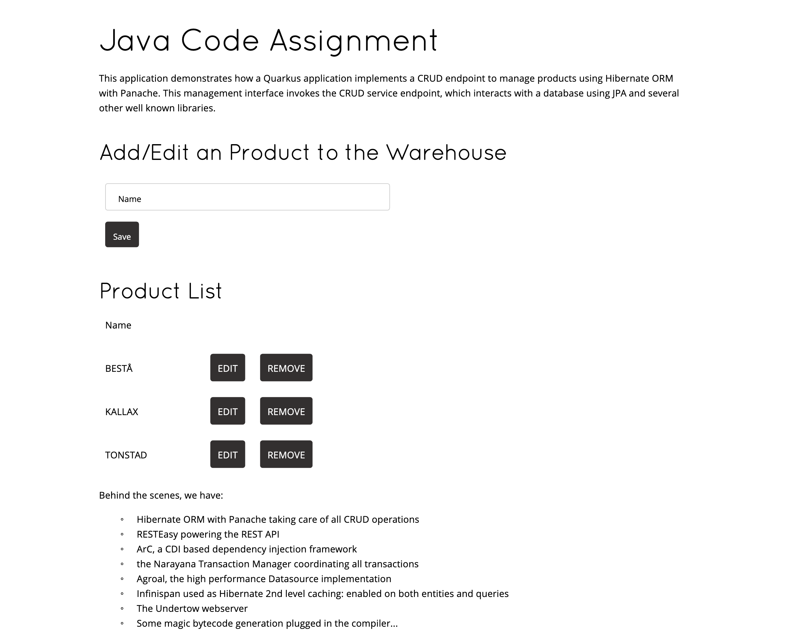
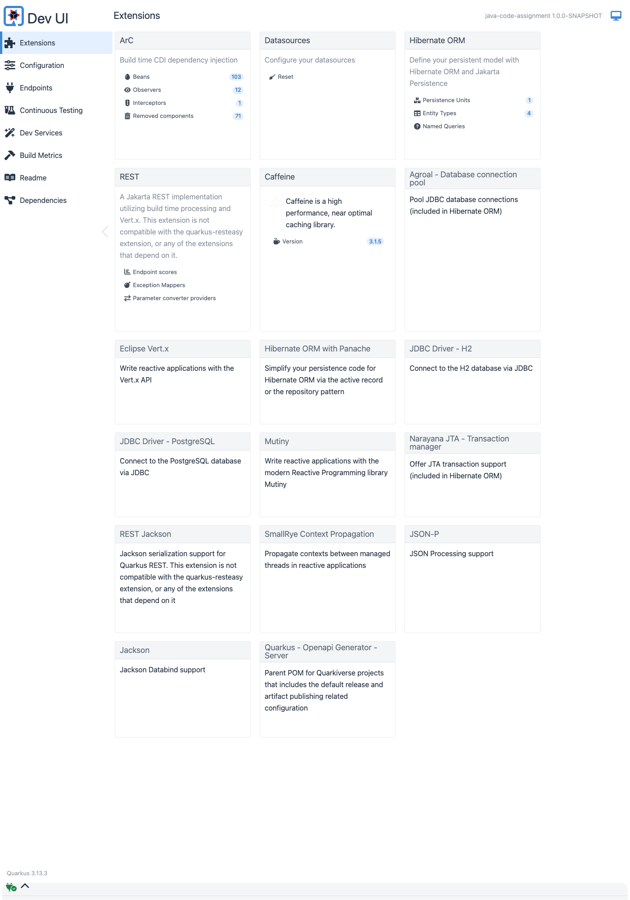

# HCL Java Code Assignment

A **Quarkus 3.13.3** REST API built with hexagonal (ports-and-adapters) architecture, covering Product, Store, Warehouse, and Allocation domains. Includes full test coverage, JaCoCo reporting, and a GitHub Actions CI/CD pipeline.

---

## Application Screenshots

### Index Page



### Quarkus Dev UI (`/q/dev-ui`)



---

## Architecture

The project follows **hexagonal (ports-and-adapters) architecture** across all four business domains:

```
java-assignment/src/main/java/com/fulfilment/application/monolith/
│
├── products/
│   ├── domain/
│   │   └── models/                   # Product (JPA entity)
│   └── adapters/
│       ├── database/                 # ProductRepository (PanacheRepository)
│       └── restapi/                  # ProductResource
│
├── stores/
│   ├── domain/
│   │   ├── models/                   # Store (PanacheEntity — Active Record)
│   │   ├── events/                   # StoreCreatedEvent, StoreUpdatedEvent, StoreDeletedEvent
│   │   └── usecases/                 # StoreService (@Transactional), StoreEventObserver
│   └── adapters/
│       ├── restapi/                  # StoreResource
│       └── gateway/                  # LegacyStoreManagerGateway (CDI AFTER_SUCCESS observer)
│
├── location/
│   └── adapters/
│       └── gateway/                  # LocationGateway (implements LocationResolver port)
│
├── warehouses/
│   ├── domain/
│   │   ├── models/                   # Warehouse, Location
│   │   ├── events/                   # WarehouseCreatedEvent, WarehouseArchivedEvent, WarehouseReplacedEvent
│   │   ├── ports/                    # CreateWarehouseOperation, ArchiveWarehouseOperation,
│   │   │                             # ReplaceWarehouseOperation, WarehouseStore, LocationResolver
│   │   └── usecases/                 # CreateWarehouseUseCase, ArchiveWarehouseUseCase,
│   │                                 # ReplaceWarehouseUseCase, WarehouseEventObserver
│   └── adapters/
│       ├── database/                 # DbWarehouse (JPA entity), WarehouseRepository (implements WarehouseStore)
│       ├── restapi/                  # WarehouseResourceImpl
│       └── gateway/                  # LegacyWarehouseGateway (CDI AFTER_SUCCESS observer)
│
└── allocation/
    ├── domain/
    │   ├── models/                   # WarehouseAllocation (PanacheEntity)
    │   ├── events/                   # AllocationCreatedEvent
    │   ├── ports/                    # AllocationStore (repository interface)
    │   └── usecases/                 # AllocateWarehouseUseCase (3 business constraints)
    └── adapters/
        ├── database/                 # AllocationRepository (implements AllocationStore)
        └── restapi/                  # AllocationResource, AllocationRequest
```

### Key Design Decisions

| Concern | Solution |
|---|---|
| Persistence — Store | Active Record (`PanacheEntity`) — entity manages its own lifecycle |
| Persistence — Product, Warehouse, Allocation | Repository pattern (`PanacheRepository`) — separation of data access |
| Port interfaces | `WarehouseStore`, `AllocationStore`, `LocationResolver` decouple domain from infrastructure |
| Event-driven side effects | CDI `Event<T>` fired inside use cases; `@Observes(during = AFTER_SUCCESS)` in gateway adapters |
| Location validation | `LocationResolver` port implemented by `LocationGateway` (8 Dutch locations) |
| Allocation constraints | Max 2 warehouses per product/store · Max 3 warehouses per store · Max 5 products per warehouse |
| Test isolation | H2 in-memory (`%test` / `%dev` profile); PostgreSQL for production only |
| Coverage | `quarkus-jacoco` + `jacoco-maven-plugin` merge → **96.2%** instruction coverage |

---

## Requirements

- **JDK 17+** (`JAVA_HOME` must be set)
- **Maven wrapper** (`./mvnw`) included — no separate Maven install needed
- **PostgreSQL** for production only (H2 is used automatically in dev and test)

---

## Starting the Application

### Prerequisites

| Tool | Version | Check |
|---|---|---|
| JDK | 17+ | `java -version` |
| Maven wrapper | bundled | `./mvnw --version` |
| PostgreSQL | any (prod only) | `psql --version` |

> **Dev and test modes use H2 in-memory — no database setup required.**

### Step 1 — Clone the repository

```sh
git clone <repo-url>
cd hcl-case-study/java-assignment
```

### Step 2 — Run in Dev Mode (recommended)

```sh
./mvnw quarkus:dev
```

- Starts on **http://localhost:8080**
- Uses **H2 in-memory** database automatically (`%dev` profile)
- **Live reload** enabled — code changes apply instantly on next request
- **Dev UI** available at **http://localhost:8080/q/dev-ui**

### Step 3 — Verify the application is running

```sh
curl http://localhost:8080/product
curl http://localhost:8080/store
curl http://localhost:8080/warehouse
```

### Step 4 — Run Tests

```sh
./mvnw verify
```

Runs all **62** `@QuarkusTest` integration tests against H2. JaCoCo coverage report is generated at `target/site/jacoco/index.html`.

### Step 5 — Build & Run as JAR (Production)

Configure PostgreSQL in `src/main/resources/application.properties`, then:

```sh
./mvnw package -DskipTests
java -jar target/quarkus-app/quarkus-run.jar
```

---

## API Endpoints

| Domain | Base Path | Endpoints | Status |
|---|---|---|---|
| Product | `/product` | 10 | ✓ All pass |
| Store | `/store` | 13 | ✓ All pass |
| Warehouse | `/warehouse` | 10 | ✓ All pass |
| Allocation *(bonus)* | `/allocation` | 10 | ✓ All pass |
| **Total** | | **43** | **43 / 43** |

See [`java-assignment/api-report.html`](java-assignment/api-report.html) for the full live-verified endpoint reference, and [`java-assignment/api-report.md`](java-assignment/api-report.md) for the plain-text version.

### Quick test

```sh
# List products
curl http://localhost:8080/product

# Create a store
curl -X POST http://localhost:8080/store \
  -H "Content-Type: application/json" \
  -d '{"name":"AMSTERDAM-STORE","quantityProductsInStock":10}'
```

---

## API Test Report

**Live verified:** 2026-09-11 · Quarkus 3.13.3 · H2 in-memory

### Product API — `/product`

| Endpoint | Method | Status | Description |
|---|---|---|---|
| `/product` | GET | 200 | List all products |
| `/product/{id}` | GET | 200 | Get product by id |
| `/product/{id}` | GET | 404 | Non-existent product |
| `/product` | POST | 201 | Create product |
| `/product` | POST | 422 | Preset id rejected |
| `/product/{id}` | PUT | 200 | Full update |
| `/product/{id}` | PUT | 422 | Null name rejected |
| `/product/{id}` | PUT | 404 | Non-existent product |
| `/product/{id}` | DELETE | 204 | Delete product |
| `/product/{id}` | DELETE | 404 | Non-existent product |

### Store API — `/store`

| Endpoint | Method | Status | Description |
|---|---|---|---|
| `/store` | GET | 200 | List all stores |
| `/store/{id}` | GET | 200 | Get store by id |
| `/store/{id}` | GET | 404 | Non-existent store |
| `/store` | POST | 201 | Create store |
| `/store` | POST | 422 | Preset id rejected |
| `/store/{id}` | PUT | 200 | Full update |
| `/store/{id}` | PUT | 422 | Null name rejected |
| `/store/{id}` | PUT | 404 | Non-existent store |
| `/store/{id}` | PATCH | 200 | Partial update |
| `/store/{id}` | PATCH | 422 | Null name rejected |
| `/store/{id}` | PATCH | 404 | Non-existent store |
| `/store/{id}` | DELETE | 204 | Delete store |
| `/store/{id}` | DELETE | 404 | Non-existent store |

### Warehouse API — `/warehouse`

| Endpoint | Method | Status | Description |
|---|---|---|---|
| `/warehouse` | GET | 200 | List active warehouses |
| `/warehouse/{buCode}` | GET | 200 | Get warehouse by code |
| `/warehouse/{buCode}` | GET | 404 | Non-existent / archived |
| `/warehouse` | POST | 201 | Create warehouse |
| `/warehouse` | POST | 400 | Invalid location |
| `/warehouse` | POST | 400 | Location at capacity |
| `/warehouse/{buCode}/replacement` | POST | 200 | Replace warehouse |
| `/warehouse/{buCode}/replacement` | POST | 400 | Stock mismatch |
| `/warehouse/{buCode}` | DELETE | 204 | Archive warehouse |
| `/warehouse/{buCode}` | DELETE | 404 | Non-existent warehouse |

### Allocation API — `/allocation` *(Bonus)*

> **Business Constraints:** max 2 warehouses per product/store · max 3 warehouses per store · max 5 products per warehouse

| Endpoint | Method | Status | Description |
|---|---|---|---|
| `/allocation` | GET | 200 | List all allocations |
| `/allocation/warehouse/{buCode}` | GET | 200 | Allocations for a warehouse |
| `/allocation/store/{storeId}` | GET | 200 | Allocations for a store |
| `/allocation` | POST | 201 | Create allocation |
| `/allocation` | POST | 400 | Duplicate allocation |
| `/allocation` | POST | 400 | Constraint 1: max 2 warehouses per product/store |
| `/allocation` | POST | 400 | Constraint 2: max 3 warehouses per store |
| `/allocation` | POST | 404 | Non-existent warehouse |
| `/allocation` | POST | 404 | Non-existent product |
| `/allocation` | POST | 404 | Non-existent store |

---

## Test Coverage Report

**Date:** 2026-09-11 · **Tests:** 62 passing, 0 failures · **Overall:** 96.2% instruction coverage

Coverage is measured by merging `jacoco-quarkus.exec` (Quarkus integration tests) and `jacoco.exec` (unit tests) via `jacoco:merge`.

### Test Suites

| Suite | Tests | Kind |
|---|---|---|
| `AllocationEndpointTest` | 10 | `@QuarkusTest` — REST integration |
| `ProductEndpointTest` | 11 | `@QuarkusTest` — REST integration |
| `StoreEndpointTest` | 10 | `@QuarkusTest` — REST integration |
| `WarehouseEndpointTest` | 9 | `@QuarkusTest` — REST integration |
| `ArchiveWarehouseUseCaseTest` | 4 | Unit — in-memory fakes |
| `CreateWarehouseUseCaseTest` | 7 | Unit — in-memory fakes |
| `ReplaceWarehouseUseCaseTest` | 7 | Unit — in-memory fakes |
| `LocationGatewayTest` | 4 | Unit — plain Java |
| **Total** | **62** | |

### Coverage by Domain

#### Allocation

| Class | Instruction % | Branch % |
|---|---|---|
| `WarehouseAllocation` | **100%** | — |
| `AllocationRepository` | **100%** | **100%** |
| `AllocationRequest` | **100%** | — |
| `AllocationResource` | 91.8% | 50.0% |
| `AllocateWarehouseUseCase` | 91.4% | 81.8% |

#### Product

| Class | Instruction % | Branch % |
|---|---|---|
| `ProductResource` | **100%** | **100%** |
| `ProductResource.ErrorMapper` | **100%** | **100%** |
| `ProductRepository` | **100%** | — |
| `Product` ⚠ | 33.3% | — |

> `Product`: the `Product(String name)` constructor is dead code — JSON deserialization uses the no-arg constructor. Not a testing gap.

#### Store

| Class | Instruction % | Branch % |
|---|---|---|
| `StoreResource` | **100%** | **100%** |
| `StoreResource.ErrorMapper` | **100%** | **100%** |
| `StoreService` | **100%** | 90.0% |
| `LegacyStoreManagerGateway` | 94.9% | — |
| `Store` ⚠ | 33.3% | — |

> `Store`: same dead-code constructor as `Product` above.

#### Warehouse

| Class | Instruction % | Branch % |
|---|---|---|
| `WarehouseResourceImpl` | **100%** | **100%** |
| `DbWarehouse` | **100%** | — |
| `ArchiveWarehouseUseCase` | **100%** | **100%** |
| `CreateWarehouseUseCase` | **100%** | 91.7% |
| `Warehouse` (domain model) | **100%** | — |
| `Location` | **100%** | — |
| `ReplaceWarehouseUseCase` | 94.2% | 93.8% |
| `WarehouseRepository` ⚠ | 88.9% | 50.0% |

> `WarehouseRepository`: 1 missing branch is a defensive null-guard that is unreachable in practice.

#### Location

| Class | Instruction % | Branch % |
|---|---|---|
| `LocationGateway` | **100%** | — |

### Coverage Summary

| Metric | Result |
|---|---|
| Tests | **62 / 62** passing |
| Instruction coverage | **96.2%** |
| Branch coverage | **87.5%** |
| Classes at 100% | 16 / 24 |
| Classes ≥ 90% | 21 / 24 |
| Classes < 90% | 3 (all dead code — unreachable constructors) |

Full per-class breakdown: [`java-assignment/coverage.md`](java-assignment/coverage.md)

---

## CI/CD Pipeline

GitHub Actions workflow at [`.github/workflows/ci.yml`](.github/workflows/ci.yml):

**Triggers:** push or PR to `main` touching `java-assignment/**`

```
build-and-test  →  package (main branch only)
    │                   │
    ├─ ./mvnw verify    ├─ ./mvnw package -DskipTests
    ├─ Upload JaCoCo    └─ Upload quarkus-fast-jar artifact
    └─ Print coverage %
```

| Job | Runs on | Artifact |
|---|---|---|
| `build-and-test` | every push / PR | JaCoCo HTML report (14 days) |
| `package` | main branch push only | `quarkus-app/` fast-jar (7 days) |

---

## About the Code Base

Some of this code is based on [quarkus-quickstarts](https://github.com/quarkusio/quarkus-quickstarts) · Quarkus 3.13.3 · Java 17

See [CODE_ASSIGNMENT.md](java-assignment/CODE_ASSIGNMENT.md) for the original task descriptions and [QUESTIONS.md](java-assignment/QUESTIONS.md) for design questions and answers.
